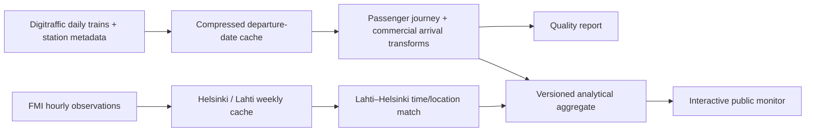
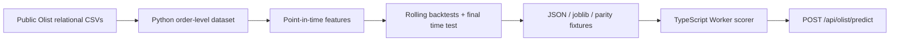

# Applied AI Lab


[](https://github.com/Sintagmatarches/applied-ai-lab/actions/workflows/ci.yml)

Evidence-backed data products built to be inspected: reproducible acquisition and transformation, explicit analytical definitions, honest evaluation and working public interfaces.

[Open Applied AI Lab](https://applied-ai-lab.smjlw.chatgpt.site/) · [Finland Rail Reliability Monitor](https://applied-ai-lab.smjlw.chatgpt.site/finland-rail-reliability-monitor) · [Olist Delivery Delay Predictor](https://applied-ai-lab.smjlw.chatgpt.site/olist-delivery-delay-predictor)

## Completed projects

| Project | Primary skills | Public result |
| --- | --- | --- |
| Finland Rail Reliability Monitor | Analytics engineering, BI, official APIs, data quality, Microsoft Fabric design, Power BI/DAX | Historical Finnish passenger-rail analysis plus a recent Lahti–Helsinki operational snapshot |
| Olist Delivery Delay Predictor | Python ML, point-in-time features, chronological evaluation, model parity, server inference | Working relative delay-risk scorer with held-out evidence and limitations |

## Finland Rail Reliability Monitor

The monitor answers: **How reliable are Finnish passenger trains, routes and stations, and when and where are delays most likely to occur?** It uses official [Fintraffic / Digitraffic railway data](https://www.digitraffic.fi/en/railway-traffic/) directly rather than a copied dataset.

The committed analytical snapshot covers **1 August 2025 through 31 July 2026**, twelve fully completed operating months retrieved on 9 August 2026. The population is Digitraffic `Long-distance` and `Commuter` trains. Passenger endpoints and station rankings require official station metadata `passengerTraffic=true`; depot/service locations are excluded at the transformation layer.

### Network results

| Metric | Result |
| --- | ---: |
| Modelled passenger journeys | 403,054 |
| Journeys with a completed final arrival | 400,518 |
| Final arrivals within 5 minutes | 95.81% |
| Final arrivals within 15 minutes | 98.91% |
| Whole-train cancellation rate | 0.49% |
| Median / 90th-percentile final delay | 0.0 / 3.0 minutes |
| Direct Lahti–Helsinki services | 24,351 |

“On time” defaults to a completed final commercial arrival no more than five whole minutes late. The site lets the reviewer switch between 5-, 10-, 15- and 30-minute thresholds. Cancelled trains, cancelled commercial rows and missing actual times are measured separately and are never changed to zero delay.

### Findings

- Network reliability was 95.8% within five minutes, but June 2026 was materially lower at about 92.4%; one recent year supports an internal seasonal comparison, not a long-run trend claim.
- Direct Lahti → Helsinki services reached 91.0% within five minutes versus 93.7% for Helsinki → Lahti. The median delay change on either segment was zero, while the 90th-percentile arrival delay was five and four minutes respectively.
- Among frequent end-to-end routes with at least 1,000 completed journeys, Helsinki–Rovaniemi had 72.0% within five minutes and a 16-minute 90th percentile; Helsinki–Joensuu, Helsinki–Jyväskylä and Helsinki–Oulu were also persistently below 90% across the observed months.
- Long-distance IC trains reached 86.8% within five minutes versus 97.6% for the high-volume HL commuter type. The interface always shows volume and cancellation rate so service types are not compared without denominators.
- In the scoped FMI match, freezing departures on the Lahti–Helsinki segment had about 90.2% within five minutes versus 92.8% when none of the selected adverse conditions were present. This is an unadjusted association, not a causal weather estimate; the strong-wind group has only 32 completed journeys and its rate is withheld in the UI.

### Reproducible pipeline



The Python standard-library pipeline downloads only missing source partitions, respects Digitraffic identification/compression guidance, splits FMI requests into the official seven-day maximum, converts UTC using `Europe/Helsinki`, and produces a compact public artifact plus ignored full-grain curated CSVs. Raw third-party responses and the 41 MB journey fact are not committed.

```bash
python -m rail.pipeline
python -m unittest discover -s rail/tests
```

Important references:

- [`rail/pipeline.py`](rail/pipeline.py) — acquisition, transformation, metrics, quality and BI extracts;
- [`artifacts/rail-summary.json`](artifacts/rail-summary.json) — versioned public analytical snapshot;
- [`artifacts/rail-quality.json`](artifacts/rail-quality.json) — source counts, checks and definitions;
- [`docs/rail/methodology.md`](docs/rail/methodology.md) — grains, metrics, weather scope and limitations;
- [`docs/rail/data-dictionary.md`](docs/rail/data-dictionary.md) — analytical tables and fields;
- [`docs/rail/architecture.md`](docs/rail/architecture.md) — public and Fabric architecture.

### Microsoft Fabric and Power BI

The repository includes two Fabric notebook sources, an incremental Bronze/Silver/Gold Lakehouse design, quality gates, watermark policy, Power BI star schema, threshold-aware DAX measures and a seven-page report specification.

- [`fabric/`](fabric/) — workspace object plan and runnable ingestion/transformation notebook code;
- [`power-bi/measures.dax`](power-bi/measures.dax) — production measures for journeys, arrivals, cancellations, missing actuals, percentiles and threshold selection;
- [`power-bi/README.md`](power-bi/README.md) — semantic relationships, report pages and deployment checklist.

A Fabric capacity/workspace, attached Lakehouse, scheduled pipeline and Power BI tenant permissions are required outside GitHub. They are documented, not presented as already deployed. The website is the defensible public interactive delivery because a Power BI `Publish to web` embed would require explicit tenant/licence configuration and exposes underlying model data publicly.

## Olist Delivery Delay Predictor

The Olist project ranks a historical order's risk of arriving more than 24 hours after the promised timestamp. Python owns relational data assembly, point-in-time feature engineering, chronological backtests, model comparison, fitting, calibration and artifact export. The Cloudflare TypeScript Worker evaluates only the versioned portable model for the public form.



The reproducible dataset contains 96,470 delivered orders from September 2016 through August 2018. The untouched newest 14,471-order test period contains 620 late deliveries.

| Metric | Final time test |
| --- | ---: |
| PR-AUC | 6.32% |
| Late-order prevalence / random baseline | 4.28% |
| PR-AUC lift over prevalence | 1.48× |
| ROC-AUC | 63.44% |
| Late deliveries found in top-risk 10% | 107 of 620 |
| Top-risk 10% precision | 7.39% |
| False warnings per detected delay | 12.53 |

The result is modest and is presented as a relative ranking score, not an exact probability. Logistic regression won the declared stability-adjusted top-10% capture rule across four earlier expanding-window backtests. Historical delay-rate features include only labels whose actual delivery outcome was already available before the prediction date.

Reproduce it with:

```bash
python -m pip install -r requirements-ml.txt -r requirements-data.txt
npm ci
npm run ml:download-data
npm run ml:build-data
npm run ml:validate
npm run ml:train
npm run test:ml
```

See [`artifacts/model-card.md`](artifacts/model-card.md), [`ml/train_model.py`](ml/train_model.py), [`lib/olist-model.ts`](lib/olist-model.ts) and [`tests/model-parity.test.ts`](tests/model-parity.test.ts).

## Application and validation

The public site uses Next.js/React through Vinext and a Cloudflare Worker-compatible build. Stable public assets and analytical/model artifacts use explicit cache-busting versions.

```bash
npm ci
npm test
npm run test:rail
npm run test:ml
npm run typecheck
npm run lint
```

CI builds the Worker, renders every project route, exercises both APIs, enforces exact Python↔TypeScript Olist parity, runs Python rail and ML tests, type-checks, lints and audits production dependencies. A separate Playwright suite checks the published site on desktop Chromium and a Pixel 7 viewport, including both completed projects, interactive rail thresholds, the Olist prediction form, responsive layout and browser-console errors.

## Licences and attribution

- Railway source: Fintraffic / digitraffic.fi, [CC BY 4.0](https://creativecommons.org/licenses/by/4.0/). The project transforms the source into journey, station, route and time aggregates.
- Weather source: Finnish Meteorological Institute open data, [CC BY 4.0](https://creativecommons.org/licenses/by/4.0/).
- Olist source: Brazilian E-Commerce Public Dataset by Olist, distributed through Kaggle under CC BY-NC-SA 4.0.

No secrets, raw railway archive, full-grain railway fact extract or large Olist source CSV is committed.
