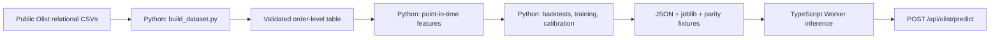

# Applied AI Lab


[](https://github.com/Sintagmatarches/applied-ai-lab/actions/workflows/ci.yml)

Applied machine-learning projects presented as working, evidence-backed web tools.

[Open the live site](https://applied-ai-lab.smjlw.chatgpt.site/) · [Try the Olist predictor](https://applied-ai-lab.smjlw.chatgpt.site/olist-delivery-delay-predictor)

## Olist Delivery Delay Predictor

The completed project ranks a historical Olist order’s risk of arriving more than 24 hours after the promised timestamp. The model is trained in **Python** with pandas and scikit-learn. TypeScript does not train or replace the model: it evaluates the versioned coefficients and preprocessing contract inside the production Worker.



The source is the [Brazilian E-Commerce Public Dataset by Olist](https://www.kaggle.com/datasets/olistbr/brazilian-ecommerce), published under CC BY-NC-SA 4.0. The repository contains the complete build code and pins every source-table SHA-256; a changed upstream file fails the build until it is reviewed intentionally. Raw third-party CSVs are not committed.

## Evaluation

The reproducible dataset contains 96,470 delivered orders from September 2016 through August 2018. The untouched final time test contains 14,471 orders, including 620 late deliveries.

| Metric | Final time test |
| --- | ---: |
| PR-AUC | 6.32% |
| Late-order prevalence / random baseline | 4.28% |
| PR-AUC lift over prevalence | 1.48× |
| ROC-AUC | 63.44% |
| Late deliveries found in top-risk 10% | 107 of 620 |
| Top-risk 10% precision | 7.39% |
| False warnings per detected delay | 12.53 |

The result is modest. Removing label-availability leakage made it weaker than the previous result, but defensible: an order purchased earlier contributes to late-rate history only after its actual delivery outcome has become known. The UI therefore exposes a relative ranking score, not an exact probability or guarantee. Full metrics and 95% bootstrap intervals are in [`artifacts/metrics.json`](artifacts/metrics.json).

## Key decisions

- **Metric:** I chose delay capture in a fixed top-10% review queue as the primary backtest criterion because it maps to bounded operational capacity and remains interpretable when late-order prevalence shifts sharply over time. The rule subtracts the standard deviation across four backtests. PR-AUC lift over each fold’s prevalence and ROC-AUC are tie-breakers; raw PR-AUC, precision and false-warning cost remain visible.
- **Model:** I compared logistic regression, XGBoost and CatBoost. Logistic regression won the declared backtest rule. It also has an auditable portable representation, but the code no longer assumes it must win: training stops if a selected model lacks a parity-tested exporter.
- **Time split:** I used four expanding-window backtests, then trained on the oldest 70%, calibrated on the following 15%, and evaluated once on the newest 15%. Random splitting would mix changing marketplace conditions across time.
- **Point-in-time features:** Purchase counts use purchase days strictly before the prediction day. Late rates use only labels whose actual customer-delivery day is strictly earlier. This distinguishes “an order exists” from “its outcome is already known.”
- **Architecture:** Python owns data assembly, validation, feature engineering, model comparison, fitting, calibration and artifact generation. A TypeScript Worker reconstructs only inference because the site runs on Cloudflare. Four committed fixtures compare all transformed features, raw scores, calibrated outputs and risk scores between Python and TypeScript at `1e-10` tolerance.
- **Explanations:** The three displayed factors are sensitivity scenarios against a fixed reference order, not SHAP values or causal attributions. The UI and API now say this explicitly.

## Reproduce the model

Requires Node.js 22.13 or later and Python 3.11 or later. Kaggle’s public dataset download is anonymous with the pinned CLI version.

```bash
python -m pip install -r requirements-ml.txt -r requirements-data.txt
npm ci
npm run ml:download-data
npm run ml:build-data
npm run ml:validate
npm run ml:train
npm run test:ml
npm test
npm run typecheck
npm run lint
```

The important code lives here:

- [`ml/build_dataset.py`](ml/build_dataset.py) — deterministic joins, primary-item policy, order-level aggregation, distance and target;
- [`ml/temporal_features.py`](ml/temporal_features.py) — purchase histories and outcome-availability histories;
- [`ml/train_model.py`](ml/train_model.py) — chronological backtests, model comparison, calibration, bootstrap intervals and export;
- [`ml/runtime_reference.py`](ml/runtime_reference.py) — authoritative portable Python scorer;
- [`artifacts/model-card.md`](artifacts/model-card.md) — model/data card and limitations;
- [`artifacts/parity-fixtures.json`](artifacts/parity-fixtures.json) — Python expected vectors and scores;
- [`lib/olist-model.ts`](lib/olist-model.ts) — production inference and input validation;
- [`tests/model-parity.test.ts`](tests/model-parity.test.ts) — exact Python↔TypeScript parity test;
- [`app/api/olist/predict/route.ts`](app/api/olist/predict/route.ts) — server API boundary.

## Leakage and serving controls

- The target, delivery timestamps, reviews, IDs and all other post-purchase facts are excluded from model inputs.
- ISO weekday is defined once as Monday=1 through Sunday=7; timestamps and calendar components use UTC in both runtimes.
- Predictions outside the observed 2016–2018 purchase range are rejected rather than silently extrapolated.
- Unknown categories are accepted and encoded as an all-zero one-hot group.
- CI rebuilds the Worker, tests the API, checks every parity fixture, runs Python dataset/temporal tests, type-checks and lints the application, and audits production dependencies.
- Production dependency audit is clean; current remaining audit findings are confined to upstream development tooling.

Stable public assets and the model artifact use explicit cache-busting versions.
