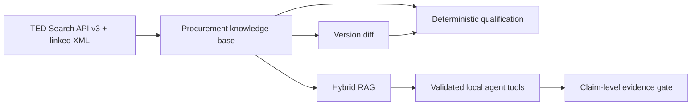
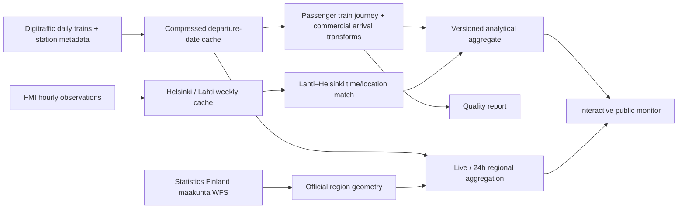
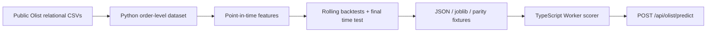

# Applied AI Lab


[](https://github.com/Sintagmatarches/applied-ai-lab/actions/workflows/ci.yml)

Evidence-backed data products built to be inspected: reproducible acquisition and transformation, explicit analytical definitions, honest evaluation and working public interfaces.

The production hostname is deployment configuration rather than a repository constant. Set `PLAYWRIGHT_BASE_URL` to run the browser suite against any deployed domain.

## Completed projects

| Project | Primary skills | Public result |
| --- | --- | --- |
| EU Tender Intelligence Agent | TED ingestion, procurement data model, deterministic qualification, change intelligence, local RAG/agent | Live official TED discovery and auditable bid-decision dashboard |
| Finland Rail Monitoring System | Live monitoring, PySpark/Delta Lakehouse, incremental Bronze/Silver/Gold, geospatial analytics, Power BI/DAX | Live choropleth plus an executable and evidenced data-platform case |
| Olist Delivery Delay Predictor | Python ML, point-in-time features, chronological evaluation, model parity, server inference | Working relative delay-risk scorer with held-out evidence and limitations |

## EU Tender Intelligence Agent

The agent solves a procurement workflow rather than generic “chat with tenders”: **discover → qualify → monitor changes → reassess**. The public dashboard queries the current official anonymous TED Search API v3, normalizes notices and lots, preserves TED/XML evidence links and compares an editable fictional supplier profile with structured mandatory conditions. Mandatory eligibility and strategic opportunity fit are shown separately; a failed certification or turnover threshold overrides any attractive fit score.

The local runtime adds official eForms XML enrichment, SQLite/FTS5 persistence, immutable notice versions, material field diffs, automatic reassessment, Nomic embeddings, hybrid retrieval, Qwen tool calling and a deterministic claim/evidence gate. It has 14 schema-validated procurement tools. Source documents are untrusted data: prompt-like text cannot select tools, change eligibility or forge citations.



Reproduce the complete local path:

```bash
python -m pip install -r requirements-ai.txt
python -m unittest discover -s tender_ai/tests
python -m tender_ai.evals.run
python -m tender_ai.live_verify
python -m uvicorn tender_ai.server:app --host 127.0.0.1 --port 8099
```

The public Cloudflare deployment never claims access to loopback Ollama. Live TED search, normalization and deterministic assessment are public; embeddings, history, agent execution and XML-enriched RAG are local. See [`docs/tender-ai-architecture.md`](docs/tender-ai-architecture.md), [`docs/tender-ai-evaluation.md`](docs/tender-ai-evaluation.md) and [`docs/tender-ai-live-verification.md`](docs/tender-ai-live-verification.md).

## Finland Rail Monitoring System

The monitor answers: **Where is Finland's passenger-rail network operating normally right now, and which regions, stations and routes are under pressure?** It uses official [Fintraffic / Digitraffic railway data](https://www.digitraffic.fi/en/railway-traffic/) and [Statistics Finland maakunta boundaries](https://stat.fi/en/services/statistical-data-services/geographic-data/statistical-areas/municipality-based-statistical-units).

### Live regional monitoring

- The `LIVE` view refreshes every minute from Digitraffic and covers a three-hour operating window around the current time. Trains marked `runningCurrently` retain their nearest previous/next commercial stops even when a severe delay moves them outside that normal window.
- The `24 HOURS` view aggregates the current and previous departure-date partitions into a strict rolling window and uses a longer server cache to protect the public API.
- `HISTORICAL` is explicitly dated, reproducible and built from the 365 committed source partitions used by the existing analysis. It is never presented as current data.
- The current metadata contains 552 Finnish station coordinates, all assigned to one of the 19 official 2026 maakunta polygons by point-in-polygon. Only the 209 Finnish stations marked `passengerTraffic=true` can create passenger-rail observations.
- Åland has zero passenger-rail stations and is reported as `No rail service`, with no disruption or reliability score.

Within a region, each train is counted once even if it has several stops there. A train crossing multiple regions contributes one observation to each affected region, which is why the national total is labelled **regional train observations**, not unique trains. The live map now uses the same 5/10/15/30-minute policy selector as the historical analysis; serious always means more than 15 minutes regardless of selection. Missing actual/current estimated timing is not converted to zero delay.

The public Disruption Score runs from 0 (best) to 100 (worst): 45% selected-threshold delayed share, 25% serious-delay share, 20% cancellation share and 10% average positive delay capped at 30 minutes. The complementary Reliability Score is `100 - disruption`. Scores below 10 are normal, 10–24.9 elevated, and 25+ serious. These are transparent operational indicators, not official Fintraffic service levels; compare scores only under the same selected policy.

The committed analytical snapshot covers **1 August 2025 through 31 July 2026**, twelve fully completed operating months retrieved on 9 August 2026. The population is Digitraffic `Long-distance` and `Commuter` trains. Passenger endpoints and station rankings require official station metadata `passengerTraffic=true`; depot/service locations are excluded at the transformation layer.

### Network results

| Metric | Result |
| --- | ---: |
| Modelled passenger train journeys | 403,054 |
| Train journeys with a completed final arrival | 400,518 |
| Final arrivals within 5 minutes | 95.81% |
| Final arrivals within 15 minutes | 98.91% |
| Whole-train cancellation rate | 0.49% |
| Median / 90th-percentile final delay | 0.0 / 3.0 minutes |
| Direct Lahti–Helsinki services | 24,351 |

“On time” defaults to a completed final commercial arrival no more than five whole minutes late. The site lets the reviewer switch between 5-, 10-, 15- and 30-minute thresholds. Cancelled trains, cancelled commercial rows and missing actual times are measured separately and are never changed to zero delay.

### Findings

- Network reliability was 95.8% within five minutes, but June 2026 was materially lower at about 92.4%; one recent year supports an internal seasonal comparison, not a long-run trend claim.
- Direct Lahti → Helsinki services reached 91.0% within five minutes versus 93.7% for Helsinki → Lahti. The median delay change on either segment was zero, while the 90th-percentile arrival delay was five and four minutes respectively.
- Among frequent end-to-end routes with at least 1,000 completed journeys, Helsinki–Rovaniemi had 72.0% within five minutes and a 16-minute 90th percentile; Helsinki–Joensuu, Helsinki–Jyväskylä and Helsinki–Oulu were also persistently below 90% across the observed months.
- Long-distance IC trains reached 86.8% within five minutes versus 97.6% for the high-volume HL commuter type. The interface always shows volume and cancellation rate so service types are not compared without denominators.
- In the scoped FMI match, freezing departures on the Lahti–Helsinki segment had about 90.2% within five minutes versus 92.8% when none of the selected adverse conditions were present. This is an unadjusted association, not a causal weather estimate; the strong-wind group has only 32 completed journeys and its rate is withheld in the UI.

### Reproducible pipeline



The Python standard-library pipeline downloads only missing source partitions, validates each daily train array/date/passenger population before atomic publication and again on cache read, respects Digitraffic identification/compression guidance, splits FMI requests into the official seven-day maximum, converts UTC using `Europe/Helsinki`, and produces a compact public artifact plus ignored full-grain curated CSVs. Raw third-party responses and the 41 MB journey fact are not committed.

The production-like data-platform layer is executable locally and in CI: PySpark 4.0.4 transforms nested train events into Delta Lake 4.0.1 Bronze/Silver/Gold tables, while content-hash watermarks make unchanged reruns no-ops and changed/forced dates replace only their partitions. Blocking gates prevent invalid data from receiving a watermark. The original monitor, source cache, KPIs and public artifacts remain unchanged.

```bash
python -m rail.pipeline
python -m rail.build_regions --refresh-stations
python -m rail.build_regional_history
python -m unittest discover -s rail/tests
python -m pip install -r requirements-rail.txt
python -m rail.lakehouse.orchestrate --start 2026-07-31 --end 2026-07-31
RAIL_SPARK_TESTS=1 python -m unittest discover -s rail/lakehouse/tests
```

Important references:

- [`rail/pipeline.py`](rail/pipeline.py) — acquisition, transformation, metrics, quality and BI extracts;
- [`artifacts/rail-summary.json`](artifacts/rail-summary.json) — versioned public analytical snapshot;
- [`artifacts/rail-quality.json`](artifacts/rail-quality.json) — source counts, checks and definitions;
- [`artifacts/rail-station-regions.json`](artifacts/rail-station-regions.json) — reproducible station-to-maakunta lookup;
- [`artifacts/rail-regional-history.json`](artifacts/rail-regional-history.json) — dated 12-month regional snapshot;
- [`docs/rail/monitoring.md`](docs/rail/monitoring.md) — live modes, score, spatial join and operational limitations;
- [`docs/rail/methodology.md`](docs/rail/methodology.md) — grains, metrics, weather scope and limitations;
- [`docs/rail/data-dictionary.md`](docs/rail/data-dictionary.md) — analytical tables and fields;
- [`docs/rail/architecture.md`](docs/rail/architecture.md) — public and Fabric architecture.
- [`docs/rail/data-platform.md`](docs/rail/data-platform.md) — executable Lakehouse layers, contracts, lineage and evidence.
- [`docs/rail/runbook.md`](docs/rail/runbook.md) — incremental operations, backfill and recovery.
- [`docs/business/`](docs/business/) — explicitly simulated requirements, backlog, change request, incident traceability and stakeholder delivery.
- [`docs/manual-tasks/USER_ACTIONS.md`](docs/manual-tasks/USER_ACTIONS.md) — only credentialed/native work left to the user.

### Microsoft Fabric and Power BI

The repository includes two Fabric notebook sources, an incremental Bronze/Silver/Gold Lakehouse design, quality gates, watermark policy, Power BI star schema, threshold-aware DAX measures and a seven-page report specification.

- [`fabric/`](fabric/) — workspace object plan and runnable ingestion/transformation notebook code;
- [`power-bi/measures.dax`](power-bi/measures.dax) — production measures for journeys, arrivals, cancellations, missing actuals, percentiles and threshold selection;
- [`power-bi/README.md`](power-bi/README.md) — semantic relationships, report pages and deployment checklist.
- [`fabric/pipeline-spec.md`](fabric/pipeline-spec.md) — activity dependencies, watermark, data-quality gates and recovery.

A Fabric capacity/workspace, attached Lakehouse, scheduled pipeline and Power BI tenant permissions are required outside GitHub. They are documented, not presented as already deployed. The website is the defensible public interactive delivery because a Power BI `Publish to web` embed would require explicit tenant/licence configuration and exposes underlying model data publicly.

## Olist Delivery Delay Predictor

The Olist project ranks a historical order's risk of arriving more than 24 hours after the promised timestamp. Python owns relational data assembly, point-in-time feature engineering, chronological backtests, model comparison, fitting, calibration and artifact export. The Cloudflare TypeScript Worker evaluates only the versioned portable model for the public form.



The reproducible dataset contains 96,470 delivered orders from September 2016 through August 2018. The newest 14,471-order final benchmark contains 620 late deliveries. It has already been observed and is not treated as a pristine test set for subsequent iterations.

| Metric | Final time test |
| --- | ---: |
| PR-AUC | 6.32% |
| Late-order prevalence / random baseline | 4.28% |
| PR-AUC lift over prevalence | 1.48× |
| ROC-AUC | 63.44% |
| Late deliveries found in top-risk 10% | 107 of 620 |
| Top-risk 10% precision | 7.39% |
| False warnings per detected delay | 12.53 |

The result is modest and is presented as a relative ranking score, not an exact probability. Logistic regression won the declared stability-adjusted top-10% capture rule across four earlier expanding-window backtests. Historical delay-rate features include only labels whose actual delivery outcome was already available before the prediction date.

An August 2026 improvement iteration retained full seller composition, tested leakage-safe seller histories, multi-seller, geographic, promise-calendar and workload features, and searched 40 model configurations plus simple blends. Its frozen development winner tied the deployed baseline at 107/620 on the final benchmark and slightly reduced PR-AUC, so it was not deployed. See [`artifacts/olist-improvement-report.md`](artifacts/olist-improvement-report.md) for the complete ablation, fold results and paired uncertainty.

Reproduce it with:

```bash
python -m pip install -r requirements-ml.txt -r requirements-data.txt
npm ci
npm run ml:download-data
npm run ml:build-data
npm run ml:validate
npm run ml:develop
npm run ml:benchmark
npm run ml:train
npm run test:ml
```

See [`artifacts/model-card.md`](artifacts/model-card.md), [`ml/train_model.py`](ml/train_model.py), [`lib/olist-model.ts`](lib/olist-model.ts) and [`tests/model-parity.test.ts`](tests/model-parity.test.ts).

## Application and validation

The public site uses Next.js/React through Vinext and a Cloudflare Worker-compatible build. Stable public assets and analytical/model artifacts use explicit cache-busting versions.

```bash
npm ci
npm test
npm run test:rail
npm run test:ml
npm run test:tender-ai
npm run eval:tender-ai
npm run typecheck
npm run lint
```

CI builds the Worker, renders every project route, exercises both APIs, enforces exact Python↔TypeScript Olist parity, runs Python rail and ML tests, type-checks, lints and audits production dependencies. A separate Playwright suite checks the published site on desktop Chromium and a Pixel 7 viewport, including both completed projects, interactive rail thresholds, the Olist prediction form, responsive layout and browser-console errors.

## Licences and attribution

- Railway source: Fintraffic / digitraffic.fi, [CC BY 4.0](https://creativecommons.org/licenses/by/4.0/). The project transforms the source into journey, station, route and time aggregates.
- Weather source: Finnish Meteorological Institute open data, [CC BY 4.0](https://creativecommons.org/licenses/by/4.0/).
- Region boundaries: Statistics Finland municipality-based statistical units WFS, [CC BY 4.0](https://creativecommons.org/licenses/by/4.0/).
- Olist source: Brazilian E-Commerce Public Dataset by Olist, distributed through Kaggle under CC BY-NC-SA 4.0.

No secrets, raw railway archive, full-grain railway fact extract or large Olist source CSV is committed.
