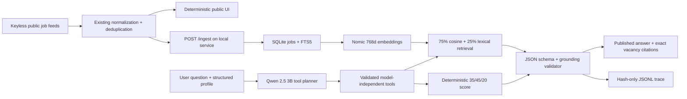

# Local Job Search AI architecture

## Operating boundary

The existing account-free Arbeitnow/Jobicy search remains the production acquisition path. Local AI is an optional capability layer: it neither logs into LinkedIn nor calls a paid model/search API. The public Cloudflare worker deliberately returns `connected: false`; only local development proxies to an HTTP loopback service.

## Components and data flow



`job_ai/ollama.py` is a standard-library HTTP adapter for `/api/chat`, `/api/embed` and `/api/tags`. Model names, timeouts, top-k, database and trace paths come from environment configuration. Retrieval and tool contracts do not depend on Qwen or Nomic and can be reused with another Ollama-compatible model.

SQLite is the durable local knowledge base. A record stores the stable ID, canonical URL, source, company, title, location/remote state, inert description, requirements, discovery/update times, embedding model/dimensions and vector. Upsert changes invalidate only the affected vector. FTS5 supplies lexical candidates; cosine similarity is computed against stored vectors and combined with lexical rank. Source/location/remote filters are applied before ranking.

## Agent tools and grounding

The model can select `search_jobs`, `retrieve_jobs`, `filter_results`, `rank_matches`, `compare_jobs`, `aggregate_requirements`, `analyze_job` and `analyze_profile_gap`. The registry rejects unknown tools, extra fields and wrong argument types. If planning omits a tool or produces invalid arguments, the agent makes one constrained correction attempt. Tool results are wrapped as `<untrusted_job_data>`.

The final model response must match a JSON schema. Every factual claim needs exact known job IDs. Validation compares each citation independently with trusted structured fields and deterministic tool evidence; raw job instructions, citation IDs alone, unknown IDs and unsupported claims do not pass. If nothing remains, the system publishes a safe “insufficient evidence” result. Generated unsupported claims and generated bad citations remain visible in evaluation metrics, while the UI receives only filtered claims/citations.

## Security and privacy

- Vacancy HTML is already converted to bounded inert text before local ingestion.
- Job content is always untrusted data, never a prompt or tool instruction.
- Only declared tools can execute; there is no shell, file-write, browser or delete tool.
- The Next proxy rejects non-loopback targets and external-origin path changes.
- Production does not expose or depend on Ollama.
- Traces omit raw questions and profiles. They keep a 12-character SHA-256 prefix, query length, model, retrieved IDs, tool calls/failures, latency, tokens and grounding counts.
- The local database under `data/job-ai/` is ignored and is not deployed.

## Run and recover

```bash
python -m pip install -r requirements-ai.txt
ollama pull qwen2.5:3b-instruct
ollama pull nomic-embed-text
npm run ai:serve
npm run dev
```

Open `/job-search-ai-agent`, confirm “Ollama connected,” then run public search. Results are ingested and embedded in the background. To rebuild embeddings after changing models, set `JOB_AI_EMBEDDING_MODEL`; records with a different model are automatically re-indexed. To start with an empty local knowledge base, stop the service and remove only `data/job-ai/jobs.sqlite3` plus its SQLite sidecars. This has no effect on the public feeds or browser-local saves.

Validation commands:

```bash
npm run test:job-ai
npm run eval:job-ai
npm test
npm run typecheck
npm run lint
```

The eval command requires the two local Ollama models. It runs real embedding and chat requests and overwrites the dated evidence report and JSON/JSONL artifacts. CI runs deterministic unit/integration guards without requiring Ollama.
