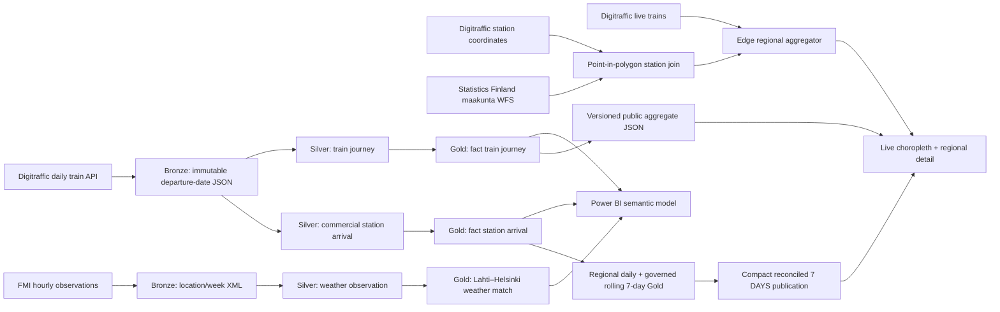

# Finland Rail Monitoring System architecture

The public project and the executable Delta Lakehouse share the same analytical definitions. The repository runs without Microsoft Fabric; Fabric and Databricks are optional hosted execution targets rather than the only place where the architecture exists.

## Public/reproducible path

`python -m rail.pipeline` retrieves one Digitraffic departure date at a time and caches the compressed response below the ignored `data/rail/` directory. Existing partitions are reused. FMI requests are split into seven-day windows because the official observation stored query permits at most 168 hours per request.

The transformation emits:

- `artifacts/rail-summary.json`, the versioned, compact source for the public monitor;
- `artifacts/rail-quality.json`, the run-level quality result and definitions;
- ignored curated CSVs below `data/rail/curated/` for local review or Fabric bootstrap.
- `artifacts/rail-station-regions.json`, the official station-to-maakunta lookup;
- `artifacts/rail-regional-history.json`, a dated regional snapshot rebuilt from the 365 daily partitions;
- `artifacts/rail-regional-7d.json`, a compact operational snapshot built from exactly seven validated completed partitions;
- `public/rail/finland-maakunta.geojson`, simplified display geometry retaining all 19 official regions.

Raw third-party responses are deliberately not committed.

## Executable Lakehouse path

The repository implementation uses PySpark and Delta Lake Bronze/Silver/Gold tables, executable contracts and persisted control tables. Fabric notebooks remain a hosted-target adapter and Power BI remains the intended enterprise consumer.

1. The pipeline passes a departure-date watermark to the ingestion notebook.
2. The notebook requests missing days and re-requests the most recent three completed operating dates, because actual times can be revised.
3. Raw responses are written to immutable, date-partitioned Bronze paths with retrieval metadata and a content hash.
4. The transformation notebook flattens trains and commercial timetable rows, applies the declared grains and writes Silver Delta tables.
5. Quality checks stop publication if train keys are duplicated, scheduled passenger route endpoints disappear, or an unexpected station-code rate exceeds the declared tolerance. Passenger endpoints require official `passengerTraffic=true`; missing actual times and cancellations are measured, not silently repaired.
6. Gold tables expose stable keys, a governed 19-region dimension/bridge, additive daily columns and complete rolling seven-day rows to a Direct Lake Power BI semantic model.
7. Refresh history, notebook runs and Delta lineage remain visible in Fabric.

## Incremental policy

- Partition key: Digitraffic `departureDate`.
- Normal run: ingest the latest seven completed UTC departure dates; identical hashes skip, while corrected hashes rebuild only complete affected windows.
- Backfill: explicit inclusive start/end parameters.
- Idempotency: replace only the requested Silver/Gold date partitions after a successful Bronze acquisition.
- Source identity: `(departureDate, trainNumber)`; repeated keys fail the quality gate.
- Time: raw timestamps remain UTC; date, weekday and hour dimensions use `Europe/Helsinki` IANA rules.

## Deployment boundary

No Fabric workspace or Power BI tenant credential is available in the repository environment. The notebooks, star-schema contract, measures and report specification are implemented and reviewable, but workspace creation, Lakehouse binding, scheduled pipeline activation and Power BI publication must be completed in the owner's Microsoft tenant. The website intentionally does not show a fake embedded report.
