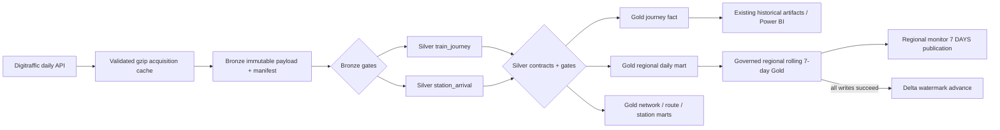

# Finland Rail Lakehouse data platform

The existing live monitor, historical Python pipeline, KPI definitions and public artifacts remain the product interface. This layer adds an executable, partition-aware data platform underneath them; it does not replace them.

## What this project demonstrates

- real PySpark 4 transformations over nested Digitraffic train and timetable data;
- Delta Lake 4 transaction logs and partition replacement rather than full-history source rebuilds;
- immutable Bronze, normalized Silver and metric-stable Gold datasets;
- content-hash watermarks, idempotent reruns, changed-source detection, forced recovery and bounded backfill;
- blocking quality gates, executable data contracts, pipeline run/audit tables and source-to-KPI lineage;
- the same code path on local Linux/WSL, GitHub Actions and a future Databricks/Fabric workspace.

## Executable architecture



The acquisition cache remains the network boundary because it already downloads only absent dates, validates array shape, expected `departureDate` and passenger scope before atomic replacement, and revalidates on read. Bronze copies those trusted bytes to a content-addressed immutable path. A changed response creates a new SHA-256 version; it never overwrites the prior good payload.

## Tables, grains and storage

| Layer | Dataset | Grain / key | Write strategy |
| --- | --- | --- | --- |
| Control | `bronze_manifest` | departure date + SHA-256 | Delta merge, insert-only |
| Control | `watermark` | departure date | Delta merge after all downstream writes |
| Control | `pipeline_runs` | run id | append |
| Control | `quality_results` | run + date + check | append |
| Bronze | `digitraffic_trains` | immutable payload version | content-addressed gzip |
| Silver | `train_journey` | `departureDate:trainNumber` | atomic `replaceWhere` date partition |
| Silver | `station_arrival` | journey + station + source event index | atomic `replaceWhere` date partition |
| Gold | `fact_train_journey` | journey key | atomic `replaceWhere` date partition |
| Gold | `mart_regional_performance_daily` | date + maakunta | atomic `replaceWhere` date partition; additive 5/10/15/30 columns |
| Gold | `dim_region` | region year + maakunta | governed 19-row replacement |
| Gold | `bridge_station_region` | region year + station | one active mapping per station/year |
| Gold | `mart_regional_performance_7d` | window end + maakunta | affected complete windows only; 19 reconciled rows |
| Gold | network daily | departure date | atomic `replaceWhere` date partition |
| Gold | route / station performance | entity | recomputed from incremental Delta facts, not source JSON |

Practical machine-readable contracts live in [`rail/contracts/data_contracts.json`](../../rail/contracts/data_contracts.json). They define grain, business key, required columns, partitioning, freshness and KPI semantics and are enforced by pipeline code and tests.

## Incremental, late data and recovery

For every requested date the planner hashes the trusted source partition and compares it with the last successfully committed watermark.

- no watermark: process;
- same hash: skip without touching facts;
- changed hash: replace only that date in Silver and Gold;
- `--force`: deliberately replace the requested date for recovery/backfill;
- any blocking failure: append a failed run, do not advance the watermark;
- retry: the same partition is selected again and `replaceWhere` makes the writes idempotent.

Facts are incremental. Cross-partition route and station marts are rebuilt from compact Delta facts so their denominators remain correct when a historical date changes; raw history is not reparsed. A changed daily hash recomputes only complete seven-day windows containing that date. Publication requires seven distinct component dates, 19 region rows, `measured <= observed`, monotonic delayed counts and a successful Gold write before either publication control state or source watermark advances.

## Operational governance

[`operational_policy.json`](../../rail/contracts/operational_policy.json) is the single Python/TypeScript policy for sample support and freshness. The empirically calibrated measured-count minima are 8 (`LIVE`), 20 (`24 HOURS`), 100 (`7 DAYS`) and 400 (`HISTORICAL`), with at least 80% timing coverage. These labels never alter the disruption status or score. Delayed-share uncertainty uses a 95% Wilson interval only; no interval is claimed for the composite score.

Freshness follows evidence, not scheduler activity: source retrieval for `LIVE`, successful validation for `24 HOURS`, and successful Gold publication for `7 DAYS`. Missing/partial partitions or out-of-order timestamps are stale. The fixed historical snapshot is dated and explicitly not operationally freshness-scored.

## Quality gates

Bronze validates non-empty JSON arrays, record shape, exact source date and passenger population before publication. The Lakehouse adds a trailing 28-partition row-count gate (blocking below 20% or above 500% of the median after a seven-partition baseline). Silver blocks duplicate source/journey/arrival keys, missing contract-critical fields, empty modelled partitions and impossible absolute final delays over 24 hours. Station rows are inner-joined to the governed Finnish passenger-station dimension. Gold contracts require stable thresholds 5/10/15/30 and metric fields; tests assert threshold consistency.

Warnings and failures are persisted to `control/quality_results`. A rejected partition cannot obtain a committed watermark and is therefore retried after correction.

## Lineage

| Source | Bronze | Silver | Gold / KPI | Consumer |
| --- | --- | --- | --- | --- |
| `departureDate`, `trainNumber` | raw unchanged | `journey_key` | journey fact grain | historical report / BI |
| train `cancelled` | raw unchanged | `cancelled` | cancellation count/rate | monitor and DAX |
| first commercial passenger `DEPARTURE.scheduledTime` | raw unchanged | UTC timestamp + Helsinki calendar fields | date/route analysis | historical views |
| final commercial passenger `ARRIVAL.differenceInMinutes` | raw unchanged | `final_delay_minutes` | on-time 5/10/15/30 | report and monitor definitions |
| commercial arrival station code | raw unchanged | station arrival + governed region code | regional max delay per train | maakunta analytics |
| source bytes | content SHA-256 path | `source_content_sha256` | run id | audit and replay |

## Reproduce locally

```bash
python -m pip install -r requirements-rail.txt
export JAVA_HOME=/path/to/jdk-17
python -m rail.lakehouse.orchestrate --start 2026-07-31 --end 2026-07-31
python -m rail.lakehouse.orchestrate --start 2026-07-31 --end 2026-07-31
RAIL_SPARK_TESTS=1 python -m unittest discover -s rail/lakehouse/tests
```

On this Windows development machine the verified fallback is WSL2 because native Hadoop-on-Windows requires the unsupported `winutils.exe` shim. The run uses a user-space Microsoft JDK 17 and Python environment; no administrator install is required. See [`runbook.md`](runbook.md).

## dbt decision

dbt was evaluated and intentionally not added. The difficult transformations start from nested JSON arrays and require Spark explode/window logic; the chosen targets already execute PySpark, and adding a second SQL runtime would duplicate contracts and orchestration without improving this pipeline. Gold marts remain small, named transformation functions with contract and integration tests. dbt becomes justified if the project later obtains a persistent Databricks SQL Warehouse or Fabric Warehouse and SQL-first analysts own the marts.

## Execution evidence and limitations

Committed JSON evidence records a real 2026-07-31 run, an unchanged-hash rerun, a duplicate rejection integration test and forced recovery test. The scheduled/manual `rail-data-platform.yml` workflow acquires seven completed UTC dates, runs the real Java 17 Spark/Delta path, reconciles the compact publication and retains evidence for 30 days. Generated Delta data stays below ignored `data/`; no source payload or invented platform screenshot is committed. Microsoft Fabric and native Power BI execution are not claimed because they require the owner's tenant. Local/CI Delta execution is real.
