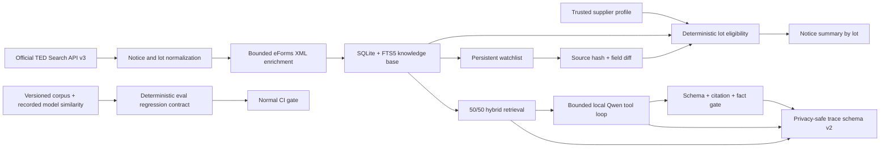

# EU Tender Intelligence architecture

## System boundary

The product implements `DISCOVER → QUALIFY PER LOT → WATCH → DETECT CHANGE → REASSESS → GROUNDED AI ANALYSIS` without treating a procurement notice as a single indivisible opportunity.

The public site calls anonymous `POST https://api.ted.europa.eu/v3/notices/search`. It provides live search, post-normalization lot filters, deterministic qualification and a device-local watchlist with explicit recheck. It does not run Ollama, retain server-side watch state or claim background monitoring.

The local FastAPI runtime adds official XML enrichment, persistence, source-version history, embeddings, the multi-step agent and a persistent watch CLI. Azure Terraform describes an optional private, scale-to-zero API deployment; it is deployment-ready but not claimed as deployed.

## Canonical procurement semantics

Structured TED/eForms selection criteria, requirement stages, submission languages and award weight/value fields are primary. Prose regex is a conservative fallback. XML records are assigned using their real `ProcurementProjectLot` identifiers; whole-document text is never appended to the first lot. TS/Python parity fixtures compare lot IDs, values, currencies, deadlines, requirements, award criteria and the resulting decision summary.

Each lot receives requirement checks with `PASS`, `FAIL`, `UNKNOWN` or `NOT_APPLICABLE`. Only `mandatory && FAIL` blocks. A mandatory unknown yields review; optional failures and unknowns are visible but do not change eligibility. If no applicable mandatory evidence exists, the lot is `INSUFFICIENT_EVIDENCE`. A notice is actionable when at least one lot is eligible and separately lists blocked, review and insufficient-evidence lots.

The heuristic fit exposes capability, geography, value and deadline components. Missing evidence contributes zero, generic EU/EEA does not imply a geographic match, and adding a matching capability cannot lower the score. It is a ranking aid, not a calibrated win probability.

## Agent and trust boundary

The model may select an allowlisted tool and notice ID, observe a bounded result and request another tool until step/tool/time limits are reached. It cannot send turnover, certifications, references, languages, countries, capabilities, contract limits, profile ID or profile version to assessment tools. Trusted `SupplierProfile` data is injected by runtime code.

The final model payload must satisfy the complete answer schema. Citations must exist, claims must overlap the cited evidence, numbers must occur in evidence and decision words must come from deterministic assessment tools. Explicit publication and lot references must match the cited evidence scope, preventing cross-notice and cross-lot contamination. Unsupported claims are removed. The result distinguishes model success, rejected output, empty claims, insufficient evidence, deterministic fallback and unavailable model.

Trace schema v2 correlates request, model, tool, retrieval, grounding and fallback events with generated trace/event IDs. Raw questions, prompts, supplier profiles, secrets and evidence bodies are absent by construction; query SHA-256 and length, identifiers, categories, counts, optional token/duration metrics, model/prompt/eval versions and grounding/fallback outcomes remain inspectable. Unknown future fields are tolerated by reporting, while legacy/missing schemas are counted without silent reinterpretation.

## Storage and change intelligence

SQLite stores notices, lots, normalized CPV rows, requirements, award criteria, security findings, evidence, source snapshots, schema metadata, change events, supplier profiles, assessments, embeddings and watch state. The unused ingestion-state placeholder was removed rather than presented as resumability. The canonical source fingerprint excludes extractor-derived requirements. TED/source version, internal ingestion revision, normalized schema version and extraction version are separate fields. Evidence updates invalidate stale embeddings.

Ingestion is transactional and idempotent. Failures retain stage/category/message details. A changed source fingerprint creates an immutable snapshot and field diff, then reassesses all lots. Latest-only live verification does not claim a real amendment pair when one was not observed.

## Evaluation and retrieval boundaries

Retrieval combines FTS5 and exact cosine with a neutral 50/50 blend. Corpus v2 contains 15 recorded public notices and 30 notice-grouped queries (16 tuning / 14 holdout). The committed matrix was produced by the actual local `nomic-embed-text` digest. Tuning ties 25/75, 50/50 and 75/25, so the frozen tie-break preserves 50/50; holdout is not used to tune it.

Normal CI never calls TED or Ollama. It verifies corpus/query/similarity/contract digests, replays the recorded matrix, evaluates extraction/grounding/agent/security, and compares protected metrics with the versioned baseline. Live TED and live Ollama verification remain separate informational evidence.

Exact scan remains capped at 10,000 candidates. The synthetic 1k/5k/10k benchmark measures scan cost and memory only; it never claims semantic quality. An ANN dependency requires measured need beyond that bounded design.
