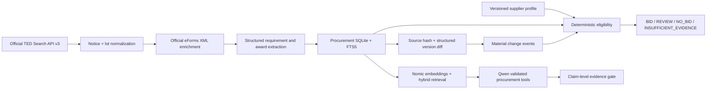

# EU Tender Intelligence architecture

## Migration audit

The migration kept generic infrastructure and replaced the product domain. Git history preserves the prior implementation; the active tree contains one procurement system, not two parallel agents.

| Reused and generalized | Removed or rewritten |
| --- | --- |
| Ollama HTTP adapter and environment model selection | Arbeitnow and Jobicy acquisition |
| Local embeddings and cosine retrieval | Vacancy, candidate and location models |
| SQLite, FTS5 and hybrid lexical/vector retrieval | 35/45/20 candidate matching |
| Validated tool-calling loop and JSON Schema output | Job ranking, saving, comparison and gap tools |
| Claim-level grounding and deterministic citation resolver | Job fixtures, evals, documentation and artifacts |
| Privacy-minimized traces and evaluation runner | Job routes, UI, APIs and production claims |
| Defensive treatment of source text as untrusted data | Vacancy-specific prompts and terminology |

## End-to-end design

The current anonymous interface is `POST https://api.ted.europa.eu/v3/notices/search`. Page-number mode is supported for bounded navigation and iteration-token mode for incremental batches. Queries support keyword, CPV, buyer/place country, publication period and procedure filters; value and deadline ranges are applied after normalization because the public field representation is not uniform across notice generations.

## Procurement knowledge base

`TenderKnowledgeBase` owns normalized `notices`, `lots`, `requirements`, `award_criteria`, `evidence`, `notice_versions`, `change_events`, `supplier_profiles`, `assessments`, `embeddings` and `ingestion_state`. `first_seen`, `last_seen`, source version and a SHA-256 material snapshot make unchanged ingestion idempotent. A changed hash creates a new immutable snapshot, structured field diffs, materiality labels and a new assessment for the active profile.

Evidence is the retrieval grain. Notice summaries, lots, extracted requirements, award criteria and XML document excerpts receive stable evidence IDs. FTS5 and local embeddings are blended 28/72, then filtered by country, CPV, buyer, value or deadline metadata.

## Decision boundary

The LLM can route tools and help interpret natural language. It cannot alter numeric or categorical eligibility outcomes. Structured turnover, reference-count, certification and language conditions are compared in deterministic code. A mandatory failure always produces `NO_BID`, even with high strategic fit. Unstructured conditions produce `REVIEW`; absence of eligibility evidence produces `INSUFFICIENT_EVIDENCE`.

The included European Data / AI Consultancy is an editable fictional demo profile. It is versioned data, not hardcoded business logic and not a claim about the repository owner or visitor.

## Security and grounding

Procurement content is wrapped conceptually as untrusted evidence. Phrases that resemble instructions are quarantined as security evidence and never enter the agent instruction channel. Tool names and arguments are allowlisted and schema-validated. The model returns evidence IDs, never URLs. The deterministic resolver rejects unknown IDs, checks lexical support, removes unsupported claims and maps accepted IDs to stored TED URLs.

## Runtime boundary

The Cloudflare site performs live anonymous TED search, normalization, lot mapping, evidence links and deterministic assessment. Ollama is deliberately loopback-only. Local ingestion additionally retrieves linked XML documents, persists SQLite history, creates embeddings, runs hybrid RAG and exposes the tool-calling agent through FastAPI.
